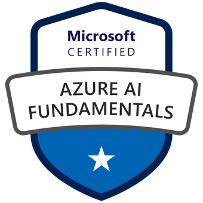
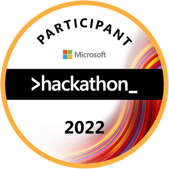

  
  
   

   
  
  

# Welcome 🏁

> *Life's too short to drive boring cars.*

That's why I drive change in the automotive industry as a tech consultant, not just cars.

I'm a passionate tech consultant and full stack developer, diving deep into the world of Microsoft Azure, Microsoft 365, .NET, React, and Bicep. Whether it's building scalable cloud solutions or crafting responsive UIs, I'm all about creating impactful tech that resonates.

What's my finish line? To leverage these powerful technologies to deliver real business value, streamline processes, and drive digital innovation.

Check out my [LinkedIn profile](https://www.linkedin.com/in/ginomessmer/) to learn more. Thanks for reading so far.

# My Certifications 🏅 

## Microsoft Certified Associate

- Microsoft Certified: Azure Administrator Associate (AZ-104)
- Microsoft Certified: Azure Developer Associate (AZ-204)

 

## Microsoft Certified Fundamentals

- Microsoft Certified: Azure Fundamentals
- Microsoft Certified: Azure AI Fundamentals

 

## Other nice badges worth showcasing

<!--
**ginomessmer/ginomessmer** is a ✨ _special_ ✨ repository because its `README.md` (this file) appears on your GitHub profile.

Here are some ideas to get you started:

- 🔭 I’m currently working on ...
- 🌱 I’m currently learning ...
- 👯 I’m looking to collaborate on ...
- 🤔 I’m looking for help with ...
- 💬 Ask me about ...
- 📫 How to reach me: ...
- 😄 Pronouns: ...
- ⚡ Fun fact: ...
-->
