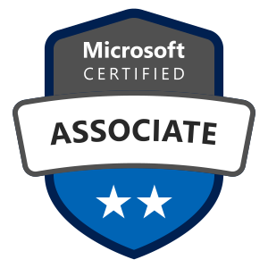
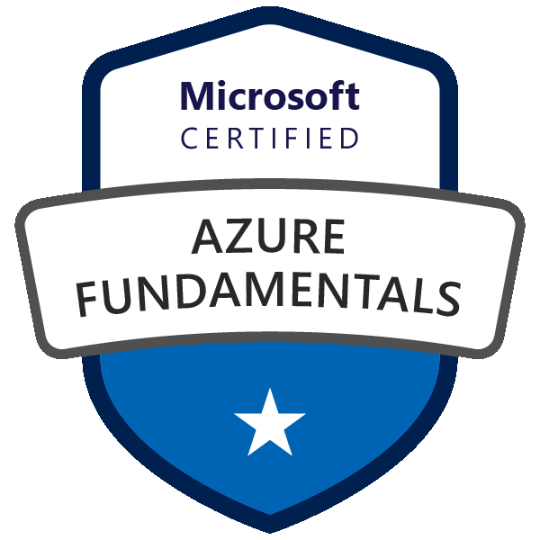
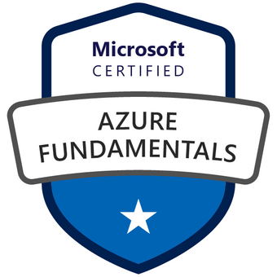
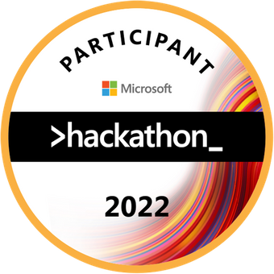
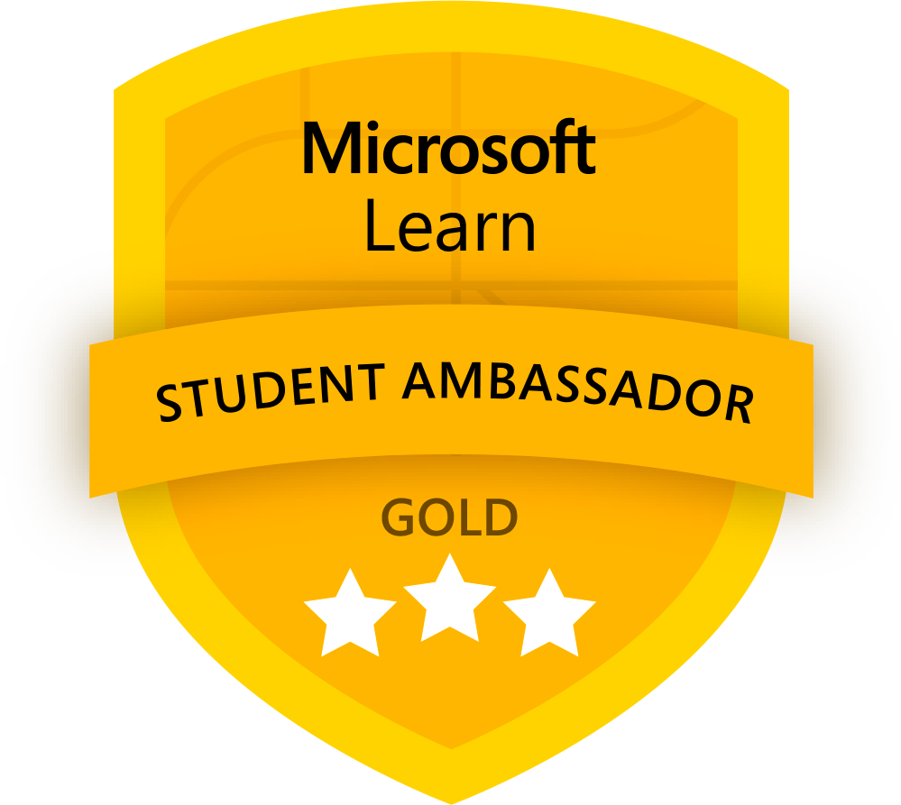

   
  

Hey, I'm Gino 👋

I have 15+ years of total experience in software development, 9 YoE in professional IT-consulting with a focus on automotive and manufacturing enterprise accounts. I'm focused on full-stack development, AI-driven SDLC - helping enterprise engineering teams build faster and more securely.

4.5 years at Microsoft working with 20+ enterprise customers across Germany and EMEA. I own technical pre-sales cycles end-to-end: from technical discussions and PoC delivery to executive presentations and deal close.

## 🛠️ What I work with

**AI & Copilot**  
GitHub Copilot &middot; OpenAI API  &middot; Azure Foundry &middot; Agent Framework &middot; RAG

**DevOps & DevSecOps**  
GitHub Actions &middot; Azure Pipelines &middot; SonarQube &middot; Entra ID/OIDC/Federated Authentication &middot; CI/CD Pipeline Hardening

**Cloud**  
Microsoft Azure &middot; Cosmos DB &middot; Functions &middot; Containers &middot; App Service &middot; Bicep

**Pre-Sales**  
Value Selling &middot; PoC Delivery &middot; Technical Demos &middot; Stakeholder Mapping &middot; Executive Presentations

## 🏅 Certifications 

### Microsoft Certified Associate

- Microsoft Certified: Azure AI Engineer Associate (AI-102)
- Microsoft Certified: Azure Administrator Associate (AZ-104)
- Microsoft Certified: Azure Developer Associate (AZ-204)

 

### Microsoft Certified Fundamentals

- Microsoft Certified: Azure Fundamentals
- Microsoft Certified: Azure AI Fundamentals

 

### Misc Achievements

<!--
**ginomessmer/ginomessmer** is a ✨ _special_ ✨ repository because its `README.md` (this file) appears on your GitHub profile.

Here are some ideas to get you started:

- 🔭 I’m currently working on ...
- 🌱 I’m currently learning ...
- 👯 I’m looking to collaborate on ...
- 🤔 I’m looking for help with ...
- 💬 Ask me about ...
- 📫 How to reach me: ...
- 😄 Pronouns: ...
- ⚡ Fun fact: ...
-->
